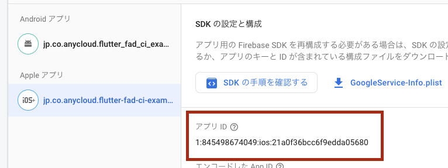
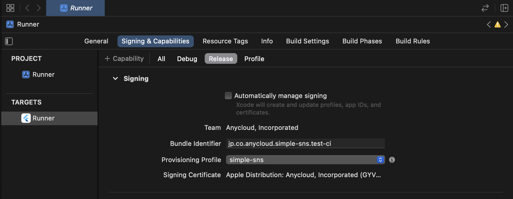

# flutter_fad_ci

Example of Continuous Delivery with Flutter, Firebase App Distribution, and Github Actions.

以下の手順で自分のプロジェクトでも使えるようになります。

## 下準備

1. Apple Developer Program に参加

- 基本的にはチームに招待してもらう

2. Firebase の登録

- https://console.firebase.google.com/u/9/?hl=ja から登録
- iOS アプリ, Android アプリの作成
  - 登録時に google-service.json や SDK などの話など出てきますが、Firebase App Distribution を使うだけであれば無視しても OK です

3. Firebase App Distribution の登録

- iOS, Android アプリでそれぞれ「開始」を押す
- テストグループを作成
  - CI で testers というグループに配信するようになっているので、testers というグループ名にする必要があります
  - テスターをグループに追加

3. .github/workflows を自分のプロジェクトにコピペ

- デフォルトでは master ブランチに PR をマージしたときにトリガーされるようになっています

## Github の Secrets を登録

- Settings / Secrets / Actions / New repository secret から登録

以下設定項目

### FIREBASE_TOKEN

`firebase login:ci` を叩いて取得

### IOS_FIREBASE_APP_ID

firebase の iOS アプリの ID

### IOS_CERTIFICATE_BASE64

1. Xcode の Preferences / Accounts / Manage Certificates まで移動
2. \+ ボタンから `Apple Distribution` を選択
3. 作成された Certificate を右クリックし、 `Export Certificate`
4. 任意のパスワードを入力して Export
5. `base64 XXX.p12 | pbcopy` でクリップボードにコピーし Secrets に貼り付け

### IOS_CERTIFICATE_PASSWORD

IOS_CERTIFICATE_BASE64 を生成する際の Export 時のパスワード

### IOS_PROVISIONING_PROFILE_BASE64

1. https://developer.apple.com/account/resources/profiles/list からプロビジョニングプロファイルを作成

- type は Ad hoc
- Devices にテスターのデバイスを登録
  - デバイスが未登録の場合は https://developer.apple.com/account/resources/devices/list から登録
- Certificates は IOS_CERTIFICATE_BASE64 生成時のもの

2. ファイルをダウンロード
3. `base64 XXX.movileprovision | pbcopy` でクリップボードにコピーし Secrets に貼り付け

## iOS 用の設定

1. Signing & Capabilities / Release で manual に設定

- Provisioning Profile は IOS_PROVISIONING_PROFILE_BASE64 作成時のものを指定

2. ios/ExportOptions.plist を自分のプロジェクトにコピペ

- teamID は Apple Developer のチーム ID
- provisioningProfiles の部分は 下の IOS_PROVISIONING_PROFILE_BASE64 作成時のものに変更
  - key が プロビジョニングプロファイルの App ID
  - string が プロビジョニングプロファイル の Name
